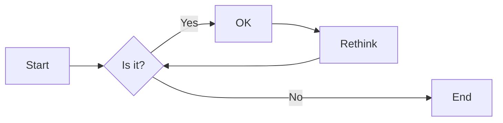
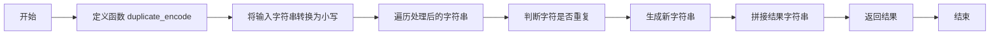

# 实验三 Python列表

班级： 21计科1

学号： B20210302123

姓名： 何香仪

Github地址：<https://github.com/deliciousbeef/python>

CodeWars地址：<https://www.codewars.com/users/%E4%BD%95%E5%B1%81%E5%B1%81>

---

## 实验目的

1. 学习Python的简单使用和列表操作
2. 学习Python中的if语句

## 实验环境

1. Git
2. Python 3.10
3. VSCode
4. VSCode插件

## 实验内容和步骤

### 第一部分

Python列表操作

完成教材《Python编程从入门到实践》下列章节的练习：

- 第3章 列表简介
- 第4章 操作列表
- 第5章 if语句

---

### 第二部分

在[Codewars网站](https://www.codewars.com)注册账号，完成下列Kata挑战：

---

#### 第一题：3和5的倍数（Multiples of 3 or 5）

难度： 6kyu

如果我们列出所有低于 10 的 3 或 5 倍数的自然数，我们得到 3、5、6 和 9。这些数的总和为 23. 完成一个函数，使其返回小于某个整数的所有是3 或 5 的倍数的数的总和。此外，如果数字为负数，则返回 0。

注意：如果一个数同时是3和5的倍数，应该只被算一次。

**提示：首先使用列表解析得到一个列表，元素全部是3或者5的倍数。
使用sum函数可以获取这个列表所有元素的和.**

代码提交地址：
<https://www.codewars.com/kata/514b92a657cdc65150000006>

---

#### 第二题： 重复字符的编码器（Duplicate Encoder）

难度： 6kyu

本练习的目的是将一个字符串转换为一个新的字符串，如果新字符串中的每个字符在原字符串中只出现一次，则为"("，如果该字符在原字符串中出现多次，则为")"。在判断一个字符是否是重复的时候，请忽略大写字母。

例如:

```python
"din"      =>  "((("
"recede"   =>  "()()()"
"Success"  =>  ")())())"
"(( @"     =>  "))(("
```

代码提交地址:
<https://www.codewars.com/kata/54b42f9314d9229fd6000d9c>

---

#### 第三题：括号匹配（Valid Braces）

难度：6kyu

写一个函数，接收一串括号，并确定括号的顺序是否有效。如果字符串是有效的，它应该返回True，如果是无效的，它应该返回False。
例如：

```python
"(){}[]" => True 
"([{}])" => True
 "(}" => False
 "[(])" => False 
"[({})](]" => False
```

**提示：
python中没有内置堆栈数据结构，可以直接使用`list`来作为堆栈，其中`append`方法用于入栈，`pop`方法可以出栈。**

代码提交地址
<https://www.codewars.com/kata/5277c8a221e209d3f6000b56>

---

#### 第四题： 从随机三元组中恢复秘密字符串(Recover a secret string from random triplets)

难度： 4kyu

有一个不为你所知的秘密字符串。给出一个随机三个字母的组合的集合，恢复原来的字符串。

这里的三个字母的组合被定义为三个字母的序列，每个字母在给定的字符串中出现在下一个字母之前。"whi "是字符串 "whatisup "的一个三个字母的组合。

作为一种简化，你可以假设没有一个字母在秘密字符串中出现超过一次。

对于给你的三个字母的组合，除了它们是有效的三个字母的组合以及它们包含足够的信息来推导出原始字符串之外，你可以不做任何假设。特别是，这意味着秘密字符串永远不会包含不出现在给你的三个字母的组合中的字母。

测试用例：

```python
secret = "whatisup"
triplets = [
  ['t','u','p'],
  ['w','h','i'],
  ['t','s','u'],
  ['a','t','s'],
  ['h','a','p'],
  ['t','i','s'],
  ['w','h','s']
]
test.assert_equals(recoverSecret(triplets), secret)
```

代码提交地址：
<https://www.codewars.com/kata/53f40dff5f9d31b813000774/train/python>

提示：

- 利用集合去掉`triplets`中的重复字母，得到字母集合`letters`，最后的`secret`应该由集合中的字母组成，`secret`长度也等于该集合。

```python
letters = {letter for triplet in triplets for letter in triplet }
length = len(letters)
```

- 创建函数`check_first_letter(triplets, first_letter)`，检测一个字母是不是secret的首字母，返回True或者False。
- 创建函数`remove_first_letter(triplets, first_letter)`,  从三元组中去掉首字母，返回新的三元组。
- 遍历字母集合letters，利用上面2个函数得到最后的结果`secret`。

---

#### 第五题： 去掉喷子的元音（Disemvowel Trolls）

难度： 7kyu

喷子正在攻击你的评论区!
处理这种情况的一个常见方法是删除喷子评论中的所有元音(字母：a,e,i,o,u)，以消除威胁。
你的任务是写一个函数，接收一个字符串并返回一个去除所有元音的新字符串。
例如，字符串 "This website is for losers LOL!"   将变成 "Ths wbst s fr lsrs LL!".

注意：对于这个Kata来说，y不被认为是元音。
代码提交地址：
<https://www.codewars.com/kata/52fba66badcd10859f00097e>

提示：

- 首先使用列表解析得到一个列表，列表中所有不是元音的字母。
- 使用字符串的join方法连结列表中所有的字母，例如：

```python
last_name = "lovelace"
letters = [letter for letter in last_name ]
print(letters) # ['l', 'o', 'v', 'e', 'l', 'a', 'c', 'e']
name = ''.join(letters) # name = "lovelace"
```

---

### 第三部分

使用Mermaid绘制程序流程图

安装VSCode插件：

- Markdown Preview Mermaid Support
- Mermaid Markdown Syntax Highlighting

使用Markdown语法绘制你的程序绘制程序流程图（至少一个），Markdown代码如下：


显示效果如下：



查看Mermaid流程图语法-->[点击这里](https://mermaid.js.org/syntax/flowchart.html)

使用Markdown编辑器（例如VScode）编写本次实验的实验报告，包括[实验过程与结果](#实验过程与结果)、[实验考查](#实验考查)和[实验总结](#实验总结)，并将其导出为 **PDF格式** 来提交。

## 实验过程与结果

请将实验过程与结果放在这里，包括：

- [第一部分 Python列表操作和if语句](#第一部分)
- [第二部分 Codewars Kata挑战](#第二部分)
- [第三部分 使用Mermaid绘制程序流程图](#第三部分)

注意代码需要使用markdown的代码块格式化，例如Git命令行语句应该使用下面的格式：


显示效果如下：

```bash
git init
git add .
git status
git commit -m "first commit"
```

如果是Python代码，应该使用下面代码块格式，例如：


显示效果如下：

```python
def add_binary(a,b):
    return bin(a+b)[2:]
```

代码运行结果的文本可以直接粘贴在这里。
**注意：不要使用截图，Markdown文档转换为Pdf格式后，截图可能会无法显示。**

### 第一题

```python
def solution(number):

    multi3or5 =  [i for i in range(number) if i%3==0 or i%5==0]

    return sum(multi3or5)    
```

### 第二题

```python
def duplicate_encode(word):
    zf = []
    word = word.lower()
    for c in word:
        if word.count(c) > 1:
            zf.append(')')
        else:
            zf.append('(') 
    return ''.join(zf)
```



### 第三题

```python
braces = "(){}[]"
def validBraces(string):
    stack = [] 
    for c in string:
        if c in '({[':
            stack.append(c)
        elif c in ')}]':
            if not stack:
                return False
            if stack[-1] != braces[braces.index(c)-1]:
                return False
            else:
                stack.pop()
    if not stack:
        return True
    else:
        return False
```

### 第四题

```python
def recoverSecret(triplets):
    res = list({i for t in triplets for i in t})
    for t in triplets * 2:。
        fix(res, t[0], t[1])
        fix(res, t[1], t[2])
    return ''.join(res)

def fix(t, a, b):
    if t.index(a) > t.index(b):
        t.remove(a)
        t.insert(t.index(b), a)
```

```mermaid
flowchart LR
 A[开始]-->B[将triplets去重]
 B-->C{是否遍历完triplets}
 C-->|否| D[通过triplets的元素找出答案字符串的字符位置关系]
 D-->E[通过fix函数不断调整答案列表的元素]
 E-->C
 C---->|是| F[结束]
 ```

### 第五题

```python
def disemvowel(string_):
    res = ''
    yuan = 'aeiouAEIOU'#元音字符串包括所有元音的大小写
    for x in string_:
        if x not in yuan:
            res += x
    return res
```

## 实验考查

请使用自己的语言并使用尽量简短代码示例回答下面的问题，这些问题将在实验检查时用于提问和答辩以及实际的操作。

1. Python中的列表可以进行哪些操作？
   - 添加元素：
   使用append()方法在列表的末尾添加一个元素。使用insert()方法在列表的指定位置插入一个元素。
   - 移除元素：使用remove()方法移除列表中的一个特定元素。使用pop()方法移除并返回列表中的一个元素（默认为最后一个元素）。
   - 修改元素：直接通过索引（使用方括号[]）修改列表中的元素。使用extend()方法添加另一个列表的元素到当前列表的末尾。
   获取特定范围的元素：使用方括号[]并指定开始和结束索引来获取列表中一系列元素。
   - 搜索元素：使用index()方法查找列表中某个元素的索引位置。使用in关键字检查一个元素是否存在于列表中。
   - 排序：使用sort()方法对列表进行原地排序（升序或降序）。使用sorted()函数创建一个排序后的新列表（不会改变原始列表）。
   - 切片：使用切片操作符:获取列表的一部分。例如：list[1:5]会获取从索引1开始，到索引5之前（不包括5）的元素。
   - 统计：使用count()方法统计列表中某个元素的出现次数。成员资格：使用not in检查一个元素是否不在列表中。
   - 迭代：可以使用for循环遍历列表的元素。也可以使用while循环和索引来遍历列表元素，如for i in range(len(list_name))。
2. 哪两种方法可以用来对Python的列表排序？这两种方法有和区别？
   Python中有两种主要的排序列表的方法：内置的 sort() 函数和 sorted() 函数
   sorted(list)返回一个对象，可以用作表达式。原来的list不变，生成一个新的排好序的list对象.
   list.sort() 不会返回对象，改变原有的list。
3. 如何将Python列表逆序打印？
   - 内置函数reversed()可以将一个可迭代对象的元素逆序输出。我们可以将列表作为参数传递给reversed()函数，并使用list()将结果转换为列表。
   - 切片操作可以用来获取列表的子列表，通过指定步长为-1，可以实现逆序输出列表。我们可以使用[::-1]来对列表进行逆序操作。
4. Python中的列表执行哪些操作时效率比较高？哪些操作效率比较差？是否有类似的数据结构可以用来替代列表？
   - 访问元素：列表在访问元素时效率很高，时间复杂度为O。
   - 追加元素：使用append()方法在列表末尾添加元素时效率很高，时间复杂度为O(1)。
   - 插入元素：使用insert()方法在列表的开头或中间插入元素时效率较低，时间复杂度为O(n)。
   - 删除元素：使用remove()或del方法删除列表中的元素时效率较低，时间复杂度为O(n)。
   - 搜索元素：使用in关键字或list.index()方法搜索列表中的元素时效率较低，时间复杂度为O(n)。
5. 阅读《Fluent Python》Chapter 2. An Array of Sequence - Tuples Are Not Just Immutable Lists小节（p30-p35）。总结该小节的主要内容。

   元组是不可变序列：元组是不可变的序列，一旦创建就不能修改。这意味着元组中的元素不能被添加、删除或更改。这种不可变性在一些情况下很有用，例如在多线程环境中共享数据时，或者在需要长期保存的数据中使用。
   元组与列表的异同：元组和列表都是序列类型，它们都可以存储任何类型的元素。然而，元组是不可变的，而列表是可变的。这意味着元组中的元素一旦设置就不能更改，而列表中的元素可以随时更改。此外，元组的语法是使用圆括号（如t = (1, 2, 3)），而列表使用方括号（如l = [1, 2, 3]）。

   元组作为键（key）：由于元组是不可变的，因此它们可以用作字典的键。在字典中，键用于查找对应的值。由于元组的不可变性，它们可以确保字典的键值对应关系的稳定性。元组和列表的创建：可以使用tuple()函数或使用圆括号来创建元组。例如，t = tuple([1, 2, 3])或t = (1, 2, 3)。而对于列表，可以使用list()函数或方括号来创建，如l = list([1, 2, 3])或l = [1, 2, 3]。
   元组和列表的遍历：可以使用for循环来遍历元组和列表中的所有元素。

## 实验总结

总结一下这次实验你学习和使用到的知识，例如：编程工具的使用、数据结构、程序语言的语法、算法、编程技巧、编程思想.
