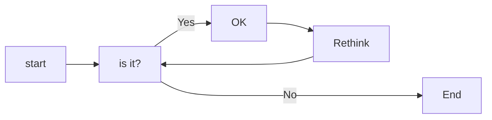
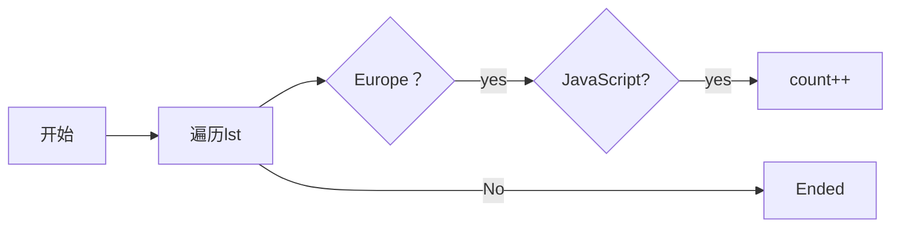

# 实验六 Python函数

班级： 21计科1

学号： B20210302123

姓名： 何香仪

Github地址：<https://github.com/deliciousbeef/python>

CodeWars地址：<https://www.codewars.com/users/%E4%BD%95%E5%B1%81%E5%B1%81>

---

## 实验目的

1. 学习Python函数的基本用法
2. 学习lambda函数和高阶函数的使用
3. 掌握函数式编程的概念和实践

## 实验环境

1. Git
2. Python 3.10
3. VSCode
4. VSCode插件

## 实验内容和步骤

### 第一部分

Python函数

完成教材《Python编程从入门到实践》下列章节的练习：

- 第8章 函数

---

### 第二部分

在[Codewars网站](https://www.codewars.com)注册账号，完成下列Kata挑战：

---

#### 第一题：编码聚会1

难度： 7kyu

你将得到一个字典数组，代表关于首次报名参加你所组织的编码聚会的开发者的数据。
你的任务是返回来自欧洲的JavaScript开发者的数量。
例如，给定以下列表：

```python
lst1 = [
  { 'firstName': 'Noah', 'lastName': 'M.', 'country': 'Switzerland', 'continent': 'Europe', 'age': 19, 'language': 'JavaScript' },
  { 'firstName': 'Maia', 'lastName': 'S.', 'country': 'Tahiti', 'continent': 'Oceania', 'age': 28, 'language': 'JavaScript' },
  { 'firstName': 'Shufen', 'lastName': 'L.', 'country': 'Taiwan', 'continent': 'Asia', 'age': 35, 'language': 'HTML' },
  { 'firstName': 'Sumayah', 'lastName': 'M.', 'country': 'Tajikistan', 'continent': 'Asia', 'age': 30, 'language': 'CSS' }
]
```

你的函数应该返回数字1。
如果，没有来自欧洲的JavaScript开发人员，那么你的函数应该返回0。

注意：
字符串的格式将总是"Europe"和"JavaScript"。
所有的数据将始终是有效的和统一的，如上面的例子。

这个卡塔是Coding Meetup系列的一部分，其中包括一些简短易行的卡塔，这些卡塔是为了让人们掌握高阶函数的使用。在Python中，这些方法包括：`filter`, `map`, `reduce`。当然也可以采用其他方法来解决这些卡塔。

[代码提交地址](https://www.codewars.com/kata/coding-meetup-number-1-higher-order-functions-series-count-the-number-of-javascript-developers-coming-from-europe)

---

#### 第二题： 使用函数进行计算

难度：5kyu

这次我们想用函数来写计算，并得到结果。让我们看一下一些例子：

```python
seven(times(five())) # must return 35
four(plus(nine())) # must return 13
eight(minus(three())) # must return 5
six(divided_by(two())) # must return 3
```

要求：

- 从0（"零"）到9（"九"）的每个数字都必须有一个函数。
- 必须有一个函数用于以下数学运算：加、减、乘、除。
- 每个计算都由一个操作和两个数字组成。
- 最外面的函数代表左边的操作数，最里面的函数代表右边的操作数。
- 除法应该是整数除法。

例如，下面的计算应该返回2，而不是2.666666...。

```python
eight(divided_by(three()))
```

代码提交地址：
<https://www.codewars.com/kata/525f3eda17c7cd9f9e000b39>

---

#### 第三题： 缩短数值的过滤器(Number Shortening Filter)

难度：6kyu

在这个kata中，我们将创建一个函数，它返回另一个缩短长数字的函数。给定一个初始值数组替换给定基数的 X 次方。如果返回函数的输入不是数字字符串，则应将输入本身作为字符串返回。

例子：

```python
filter1 = shorten_number(['','k','m'],1000)
filter1('234324') == '234k'
filter1('98234324') == '98m'
filter1([1,2,3]) == '[1,2,3]'
filter2 = shorten_number(['B','KB','MB','GB'],1024)
filter2('32') == '32B'
filter2('2100') == '2KB';
filter2('pippi') == 'pippi'
```

代码提交地址：
<https://www.codewars.com/kata/56b4af8ac6167012ec00006f>

---

#### 第四题： 编码聚会7

难度： 6kyu

您将获得一个对象序列，表示已注册参加您组织的下一个编程聚会的开发人员的数据。

您的任务是返回一个序列，其中包括最年长的开发人员。如果有多个开发人员年龄相同，则将他们按照在原始输入数组中出现的顺序列出。

例如，给定以下输入数组：

```python
list1 = [
  { 'firstName': 'Gabriel', 'lastName': 'X.', 'country': 'Monaco', 'continent': 'Europe', 'age': 49, 'language': 'PHP' },
  { 'firstName': 'Odval', 'lastName': 'F.', 'country': 'Mongolia', 'continent': 'Asia', 'age': 38, 'language': 'Python' },
  { 'firstName': 'Emilija', 'lastName': 'S.', 'country': 'Lithuania', 'continent': 'Europe', 'age': 19, 'language': 'Python' },
  { 'firstName': 'Sou', 'lastName': 'B.', 'country': 'Japan', 'continent': 'Asia', 'age': 49, 'language': 'PHP' },
]
```

您的程序应该返回如下结果：

```python
[
  { 'firstName': 'Gabriel', 'lastName': 'X.', 'country': 'Monaco', 'continent': 'Europe', 'age': 49, 'language': 'PHP' },
  { 'firstName': 'Sou', 'lastName': 'B.', 'country': 'Japan', 'continent': 'Asia', 'age': 49, 'language': 'PHP' },
]
```

注意：

- 输入的列表永远都包含像示例中一样有效的正确格式的数据，而且永远不会为空。

代码提交地址：
<https://www.codewars.com/kata/582887f7d04efdaae3000090>

---

#### 第五题： Currying versus partial application

难度： 4kyu

[Currying versus partial application](https://2ality.com/2011/09/currying-vs-part-eval.html)是将一个函数转换为具有更小arity(参数更少)的另一个函数的两种方法。虽然它们经常被混淆，但它们的工作方式是不同的。目标是学会区分它们。

Currying

是一种将接受多个参数的函数转换为以每个参数都只接受一个参数的一系列函数链的技术。

Currying接受一个函数：

```python
f：X × Y → R
```

并将其转换为一个函数：

```python
f'：X → (Y → R)
```

我们不再使用两个参数调用f，而是使用第一个参数调用f'。结果是一个函数，然后我们使用第二个参数调用该函数来产生结果。因此，如果非curried f被调用为：

```python
f(3, 5)
```

那么curried f'被调用为：

```python
f'(3)(5)
```

示例
给定以下函数：

```python
def add(x, y, z):
  return x + y + z
```

我们可以以普通方式调用：

```python
add(1, 2, 3) # => 6
```

但我们可以创建一个curried版本的add(a, b, c)函数：

```python
curriedAdd = lambda a: (lambda b: (lambda c: add(a,b,c)))
curriedAdd(1)(2)(3) # => 6
```

Partial application
是将一定数量的参数固定到函数中，从而产生另一个更小arity(参数更少)的函数的过程。

部分应用接受一个函数：

```python
f：X × Y → R
```

和一个固定值x作为第一个参数，以产生一个新的函数

```python
f'：Y → R
```

f'与f执行的操作相同，但只需要填写第二个参数，这就是其arity比f的arity少一个的原因。可以说第一个参数绑定到x。

示例:

```python
partialAdd = lambda a: (lambda *args: add(a,*args))
partialAdd(1)(2, 3) # => 6
```

你的任务是实现一个名为curryPartial()的通用函数，可以进行currying或部分应用。

例如：

```python
curriedAdd = curryPartial(add)
curriedAdd(1)(2)(3) # => 6

partialAdd = curryPartial(add, 1)
partialAdd(2, 3) # => 6
```

我们希望函数保持灵活性。

所有下面这些例子都应该产生相同的结果：

```python
curryPartial(add)(1)(2)(3) # =>6 
curryPartial(add, 1)(2)(3) # =>6 
curryPartial(add, 1)(2, 3) # =>6 
curryPartial(add, 1, 2)(3) # =>6 
curryPartial(add, 1, 2, 3) # =>6 
curryPartial(add)(1, 2, 3) # =>6 
curryPartial(add)(1, 2)(3) # =>6 
curryPartial(add)()(1, 2, 3) # =>6 
curryPartial(add)()(1)()()(2)(3) # =>6 

curryPartial(add)()(1)()()(2)(3, 4, 5, 6) # =>6 
curryPartial(add, 1)(2, 3, 4, 5) # =>6 

curryPartial(curryPartial(curryPartial(add, 1), 2), 3) # =>6
curryPartial(curryPartial(add, 1, 2), 3) # =>6
curryPartial(curryPartial(add, 1), 2, 3) # =>6
curryPartial(curryPartial(add, 1), 2)(3) # =>6
curryPartial(curryPartial(add, 1)(2), 3) # =>6
curryPartial(curryPartial(curryPartial(add, 1)), 2, 3) # =>6
```

代码提交地址：
<https://www.codewars.com/kata/53cf7e37e9876c35a60002c9>

---

### 第三部分

使用Mermaid绘制程序流程图

安装VSCode插件：

- Markdown Preview Mermaid Support
- Mermaid Markdown Syntax Highlighting

使用Markdown语法绘制你的程序绘制程序流程图（至少一个），Markdown代码如下：


显示效果如下：



查看Mermaid流程图语法-->[点击这里](https://mermaid.js.org/syntax/flowchart.html)

使用Markdown编辑器（例如VScode）编写本次实验的实验报告，包括[实验过程与结果](#实验过程与结果)、[实验考查](#实验考查)和[实验总结](#实验总结)，并将其导出为 **PDF格式** 来提交。

## 实验过程与结果

请将实验过程与结果放在这里，包括：

- [第一部分 Python函数](#第一部分)
- [第二部分 Codewars Kata挑战](#第二部分)
- [第三部分 使用Mermaid绘制程序流程图](#第三部分)

注意代码需要使用markdown的代码块格式化，例如Git命令行语句应该使用下面的格式：


显示效果如下：

```bash
git init
git add .
git status
git commit -m "first commit"
```

如果是Python代码，应该使用下面代码块格式，例如：


显示效果如下：

```python
def add_binary(a,b):
    return bin(a+b)[2:]
```

代码运行结果的文本可以直接粘贴在这里。

### 第一部分

#### 第一题

```python
def count_developers(lst):  
    count = 0  
    for developer in lst:  
        if developer['continent'] == 'Europe' and developer['language'] == 'JavaScript':  
            count += 1  
    return count
```

#### 第二题

```python
def zero(fun=None):
    # 如果fun是None，就返回0，否则返回fun(0) 
    return fun(0) if fun else 0  
  
def one(fun=None):  
    return fun(1) if fun else 1  
  
def two(fun=None):  
    return fun(2) if fun else 2  
  
def three(fun=None):  
    return fun(3)if fun else 3  
  
def four(fun=None):  
    return fun(4)if fun else 4  
  
def five(fun=None):  
    return fun(5)if fun else 5  
  
def six(fun=None):  
    return fun(6)if fun else 6  
  
def seven(fun=None):  
    return fun(7)if fun else 7  
  
def eight(fun=None):  
    return fun(8)if fun else 8  
  
def nine(fun=None):  
    return fun(9)if fun else 9  
  
def plus(y):  
      return lambda x:x+y
  
def minus(y):  
    return lambda x: x - y  
  
def times(y):  
    return lambda x: x * y  
  
def divided_by(y):  
    return lambda x: x // y  # 使用整数除法

```

#### 第三题

```python
def shorten_number(suffixes, base):
    
    def my_filter(data):
        try:
            number = int(data)
            
        except (TypeError, ValueError):
            return str(data)
        else:
            i = 0
            while number//base > 0 and i < len(suffixes)-1:
                number //= base
                i += 1
            return str(number) + suffixes[i]     
    return my_filter
```

#### 第四题

```python
def find_senior(lst): 
    
    mage = max(a['age'] for a in lst)

    return [a for a in lst if a['age']==mage]

```

#### 第五题

```python
add = lambda a,b,c: a+b+c    
a,b,c = 1,2,3

def curry_partial(f, *args):  
    
    if not callable(f): 
        return f

    num_args = f.__code__.co_argcount

    if num_args == 0:
        return f(*args)

    if len(args) >= num_args:
        return f(*args[:num_args])

    def inner(*params):    
        all_args = [*args, *params]

        if not args:
            return curry_partial(f, *all_args)      
        if not callable(args[0]):
            return curry_partial(f, *all_args)
        fn = args[0]
        num_args2 = fn.__code__.co_argcount
        if num_args2 == 0:
            return fn(*all_args)

        if len(all_args) >= num_args2:
            return fn(*all_args[:num_args2])
        else:
            return curry_partial(fn, *all_args)
        
    return inner
```

### 第三部分

第一题



**注意：不要使用截图，Markdown文档转换为Pdf格式后，截图可能会无法显示。**

## 实验考查

请使用自己的语言并使用尽量简短代码示例回答下面的问题，这些问题将在实验检查时用于提问和答辩以及实际的操作。

1. 什么是函数式编程范式？

   函数式编程（Functional Programming，简称 FP）是一种编程范式，它将计算过程视为一系列数学函数的求值。在函数式编程中，函数是一等公民，即函数可以像变量一样传递和使用。函数式编程的核心思想是通过组合纯函数（没有副作用的函数）来构建程序。

   函数式编程强调将计算过程看作是函数之间的转换而不是状态的改变。这意味着在函数式编程中，函数的结果只依赖于其输入参数，而不会改变任何外部状态。因此，函数式编程具有高度可预测性和可复用性。

   函数式编程通常使用高阶函数（即接受其他函数作为参数或返回函数的函数）和递归来实现。它也倾向于使用不可变数据结构来避免数据状态的改变。

   函数式编程具有一些优势，如代码简洁、可读性强、易于并行化和测试等。然而，它也具有一些局限性，如可能产生大量的中间变量和需要手动管理内存。

   总之，函数式编程是一种基于数学函数的编程范式，它强调计算过程的不可变性、可重用性和可组合性。

2. 什么是lambda函数？请举例说明。
   Lambda函数是一种匿名函数，也就是没有名字的函数。它们常常用在需要一个函数作为参数，但你不想显式地定义一个函数的场合。Lambda函数在Python中常用于简单的函数定义，并且只能包含一个表达式。

   例如，下面是一个Lambda函数在Python中的使用：

   用lambda关键字定义一个函数  
   add = lambda x, y: x + y  

   使用这个函数  
   result = add(5, 3)  
   print(result)  # 输出：8

   在这个例子中，lambda x, y: x + y定义了一个函数，这个函数接受两个参数x和y，并返回它们的和。然后，这个函数被赋值给变量add，可以用add(5, 3)来调用这个函数并得到结果8。

   需要注意的是，Lambda函数虽然方便，但也有其局限性。由于它们的简洁性，Lambda函数只能包含一个表达式。如果你需要写一个包含多个语句的函数，就需要使用普通的def语句来定义函数。

3. 什么是高阶函数？常用的高阶函数有哪些？这些高阶函数如何工作？使用简单的代码示例说明。

   高阶函数是一个数学术语，它是指接受一个或多个函数作为输入（即参数）或能返回一个函数作为输出的函数。简单来说，高阶函数就是可以接收一个或多个函数作为参数，并能够返回一个新的函数的函数。

   高阶函数是函数式编程的重要组成部分，它可以帮助我们编写更简洁、更模块化的代码。在许多编程语言中，高阶函数可以非常容易地实现。

   以下是一些常见的高阶函数及其工作方式：

   map()：这个函数接受一个函数和一个或多个可迭代对象作为参数，然后返回一个将输入函数应用于可迭代对象的每个元素的迭代器。

   def square(x):  
    return x * x  
    numbers = [1, 2, 3, 4, 5]

    squared = map(square, numbers)  

    print(list(squared))  # 输出：[1, 4, 9, 16, 25]

    filter()：这个函数接受一个函数和一个或多个可迭代对象作为参数，然后返回一个包含将输入函数应用于可迭代对象的每个元素后返回True的元素的迭代器。

    def is_even(x):  
    return x % 2 == 0  
  numbers = [1, 2, 3, 4, 5]  even_numbers = filter(is_even, numbers)  
  print(list(even_numbers))  # 输出：[2, 4]
  
   reduce()：这个函数接受一个二元函数和一个可迭代对象作为参数，然后连续地将该函数应用于可迭代对象的元素，从而将其减少为单个值。

   from functools import reduce  
import operator

   numbers = [1, 2, 3, 4, 5]  

   sum_of_squares = reduce(operator.add, map(square, numbers))

   print(sum_of_squares)  # 输出：55

   在这个例子中，reduce()函数使用operator.add函数将map()函数生成的平方数列表减少为单个值。

## 实验总结

总结一下这次实验你学习和使用到的知识，例如：编程工具的使用、数据结构、程序语言的语法、算法、编程技巧、编程思想。

通过本次实验，我了解了什么是高阶函数，且明白了什么是函数式编程范式，与此同时还知道了什么是lambda函数。